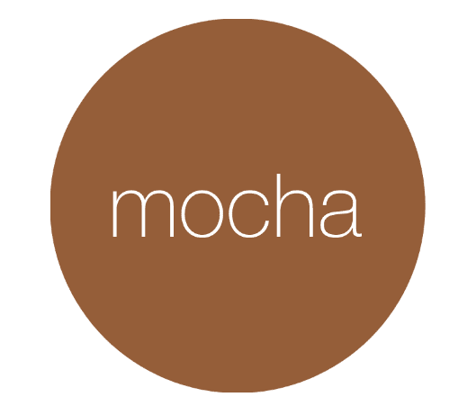

### Hi there, I'm Frank, nice to meet you! 

### I'm a Software Engineer, Instructor and Mentor!
- 👨 Pronouns: he/him/his
- 👨👩 Building a community on <a href="https://letsgetadevjob.slack.com/">Slack</a> for sharing ideas, resources and support.
- 🌱 Volunteer mentor @ <a href="https://the-collab-lab.codes/">The Collab Lab</a> and <a href="https://codethedream.org/">Code the Dream</a> to help early-career developers. 
-  📝 Writing informative and fun <a href="https://frankstepanski.medium.com/">medium articles</a> to help others learn new topics.
- 👉  Checkout some <a href="https://gist.github.com/frankstepanski">gists</a> for code references and guides.
- 🧠 2022 Learning Goals:  <a href="https://www.amazon.com/Clean-Architecture-Craftsmans-Software-Structure/dp/0134494164">Clean Architecture</a>, <a href="https://www.amazon.com/Understanding-Distributed-Systems-Second-applications/dp/1838430210/">Distributed Systems</a>, <a href="https://www.udemy.com/course/design-microservices-architecture-with-patterns-principles/">Microservices Architecture</a>.
- ⚡ Fun fact: I love traveling to <a href="https://thebestjapan.com/">Japan</a> (hopefully next trip in 2022).

<table width="100%" border="1"><tr><td valign="top">

### Frontend  

  
  
  
 
  

</td><td valign="top">

### Backend  

  
  
   
  
  

</td></tr></table>
